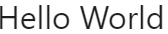

<link rel="stylesheet" href="md.css">

# Nehoa

> UI Library for React

[](https://www.npmjs.com/package/nehoa) [](https://standardjs.com)


## Description
:desert_island: **Nehoa** (nĕ-hō'-a), v.
 Is a Hawaiian word that means to be strong; to be able; to be bold. Like the name and the state, this is a React Library consisting of bold, useful, and beautiful tools/effects to help you create a stunning site. Currently this is just the begining, and the component library just consists of text effects for now, but more is on the way. As this is a React library, a peer dependency is React. In addition this library has a dependency on Styled Components. 

## Install

```bash
npm install --save nehoa
```

## Text Effects

| Title | Description | Import | Usage | Example |
|-------------|-------------|--------|-------|---------|
|**FadeOnUpChar**|The FadeOnUpChar Component allows for text to be faded up onto screen, and allows custom styling.|`import {FadeOnUpChar} from 'nehoa'`|`<FadeOnUpChar text='Hello World' style={{fontSize: '2em'}} />`||
|**FadeOnDownChar**|The FadeOnDownChar Component allows for text to be faded down onto screen, and allows custom styling. |`import {FadeOnDownChar} from 'nehoa'`|`<FadeOnDownChar text='Hello World' style={{fontSize: '2em'}}/>`||
|**FadeOn**|The FadeOn Component allows for a custom duration or delay on fade onto the screen.|`import {FadeOn} from 'nehoa'`|`<FadeOn duration='3s' delay='3s' style={{fontSize: '2em'}}>Hello World</FadeOn>`||
|**FadeOut**|The FadeOut Component allows for a custom duration or delay on fading out the screen.|`import {FadeOut} from 'nehoa'`|`<FadeOut duration='3s' delay='3s' style={{fontSize: '2em'}}>Hello World</FadeOut>`||
|**FadeOnUp**|The FadeOnUp Component allows for a custom duration or delay on fade and up onto the screen.|`import {FadeOnUp} from 'nehoa'`|`<FadeOnUp duration='3s' delay='3s' style={{fontSize: '2em'}}>Hello World</FadeOnUp>`||
|**FadeOnDown**|The FadeOnDown Component allows for a custom duration or delay on fade and down onto the screen.|`import {FadeOnDown} from 'nehoa'`|`<FadeOnDown duration='3s' delay='3s' style={{fontSize: '2em'}}>Hello World</FadeOnDown>`||


## License

MIT © [kima111](https://github.com/kima111)
